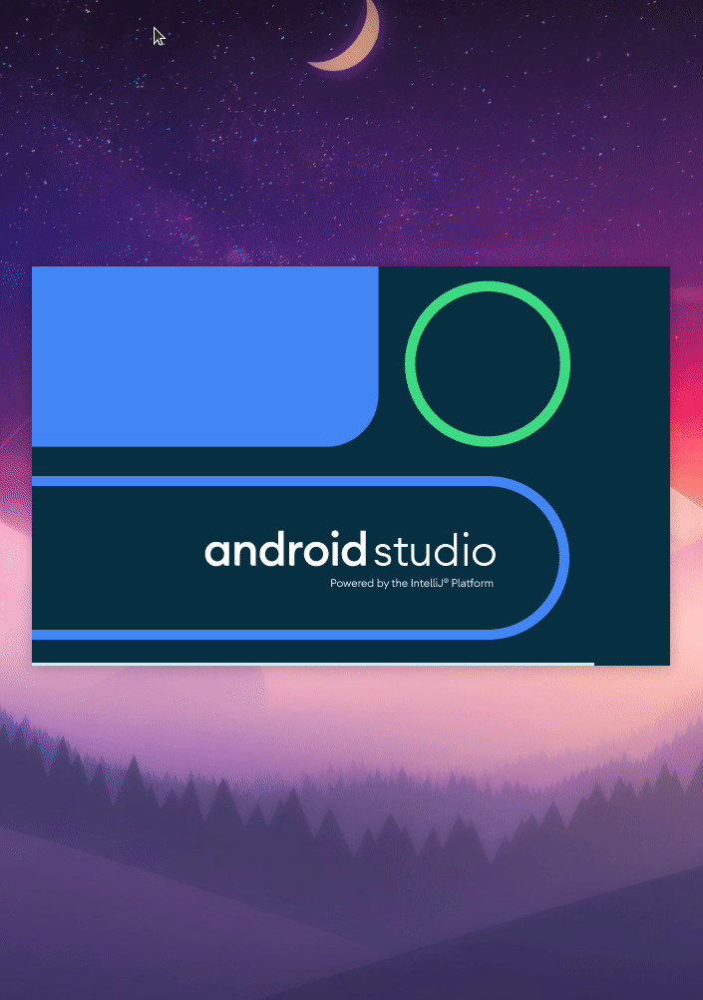

<div align="center"></div>

---

#### Циљ овог пројетка је био да се упознам са **React Native**-ом.
#### Поента ове апликације је, да студенти могу да провере шта ће током једног дана у мензи да буде сервирано од оброка за тај дан.
---

## Потребни програми:
*   [Android Studio](https://developer.android.com/studio)
*   [Node](https://nodejs.org/en/)
*   [Expo-cli](https://docs.expo.io/get-started/installation/)

## :memo: Инсталација:
```bash
    $ git clone https://github.com/Jezda1337/foodApp && cd foodApp

    $ npm -i #install dependencies from package.json 
```


## :rocket: Покретање саме апликације:
1.  Потребно је покренути пројекат помоћу **Android Studia** затим унутар програма покренути андроид емулатор. :arrow_down::arrow_down::arrow_down:


2.  Након завршетка првог корака, потребно је покренути следећу команду: 
```bash
     $ expo start --android #command for start application in android emulator
```
---
